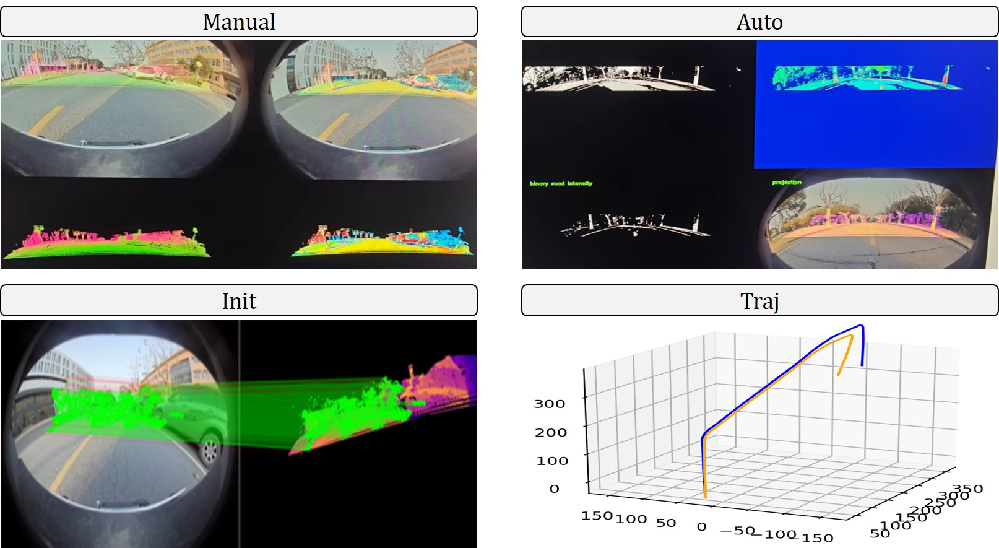
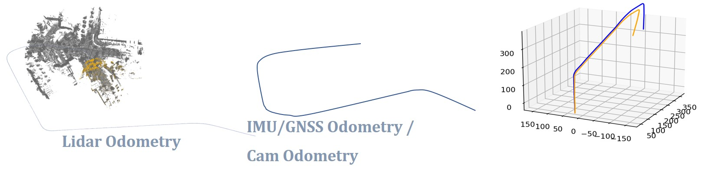

# Python-Calib-Lidar-Camera
## Python-Only Calibration Tools.
Perform calibration as simply as possible.
### Input : pcd/ply/xxx, jpg/png/xxx, trajectory poses
### Output : Extrinsic





### Basic packages
```
pip install opencv-python
pip install pypcd4
```
#### Manual Calibration With Novel Visualization Tricks
#### Easy to Initialize With Powerful Correspondence Matching Models
```
pip install kornia
```
#### Auto Calibration With Python-Only Dependencies
#### Trajectory Calibration With Python-Only Dependencies
```
pip install kiss-icp[all]
```


